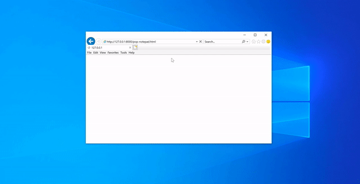

### PoC for CVE-2020-1062 
Tested with April 2020 patches on Windows 10 1903 on IE 11

* lib/explib2.js contains the code for heap spray, and for converting the abritrary RW obtained to code execution 
* modal.html is the secondary trigger file that loads the dialog window portion of the PoC 
* poc-trigger.html is the barebones trigger to demonstrate the issue.  
* poc-notepad.html is the full poc script 

#### Notes:
To simulate an ASLR leak, lib/explib2.js has a hardcoded base address of MSTHML.dll. This changes during reboots and during certain other conditions.  
You can check the base address of MSHTML.dll on your system state by attaching windbg to a running IE renderer process and typing-  `?mshtml`  
Change this line within lib/explib2.js to reflect the above obtained address
`this.mshtml_base = 0x6bcf0000;`

### PoC Demo

